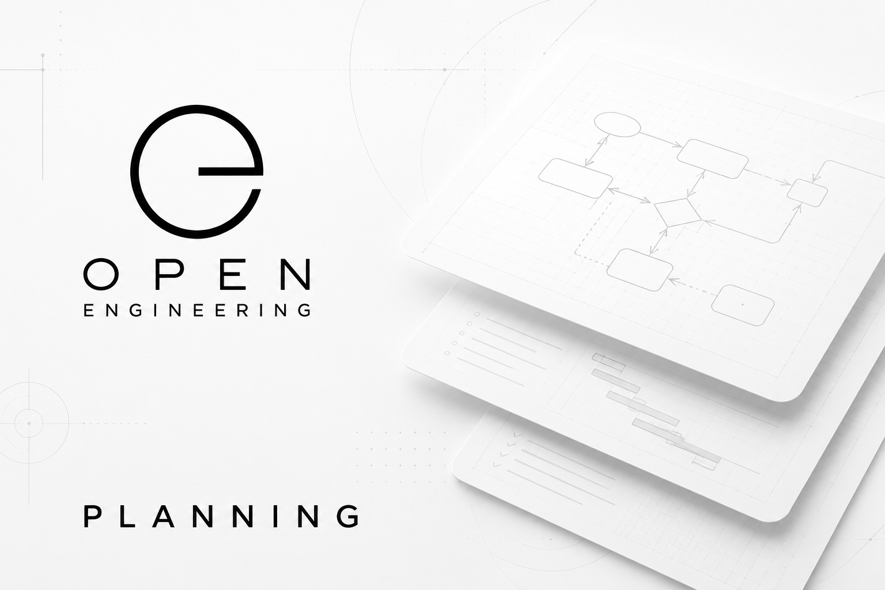

# Open Engineering Planning

Planning engineering work as reusable, connected knowledge before implementation begins.



Open Engineering Planning provides the planning layer of the Open Engineering ecosystem.

Instead of immediately writing code, building infrastructure, or deploying systems, Open Engineering Planning captures intent, explores alternatives, resolves uncertainty, and produces a structured engineering plan that can be executed by both humans and AI agents.

Planning becomes a first-class engineering artifact.

⸻

## Mission

Modern engineering projects rarely fail because developers cannot write code.

They fail because teams start implementing before they have shared understanding.

Open Engineering Planning exists to transform ideas into executable engineering knowledge by connecting:

* goals
* stories
* investigations
* evidence
* decisions
* risks
* capabilities
* schedules
* execution plans

Every planning artifact is version-controlled, traceable, and reusable.

⸻

## Why Open Engineering Planning?

Traditional planning often lives in disconnected tools:

* whiteboards
* documents
* issue trackers
* chat conversations
* meeting notes

Open Engineering Planning treats planning itself as an engineering system.

Planning artifacts become structured Open Engineering Elements that can be connected, validated, visualized, and executed.

⸻

## Planning Principles

Open Engineering Planning follows several core principles.

### Plan before build

Understand the problem before implementing the solution.

### Resolve uncertainty

Unknowns become investigations rather than assumptions.

### Decisions require evidence

Every significant decision should be supported by observations, experiments, or analysis.

### Everything connects

Planning artifacts form a semantic graph instead of isolated documents.

### AI-native

Planning is designed to be performed collaboratively by engineers and AI assistants.

### Git is the source of truth

Plans evolve through pull requests, reviews, and version history.

⸻

## Engineering Planning Elements

Typical planning repositories contain elements such as:

* Goal
* Vision
* Story
* Requirement
* Capability
* Investigation
* Observation
* Evidence
* Alternative
* Decision
* Assumption
* Constraint
* Risk
* Milestone
* Schedule
* Dependency
* Outcome

Each element can reference other engineering elements across repositories.

⸻

## Planning Workflow

A typical planning flow looks like:
```
Idea
    │
    ▼
Vision
    │
    ▼
Goals
    │
    ▼
Stories
    │
    ▼
Investigations
    │
    ├── Evidence
    ├── Alternatives
    └── Risks
    │
    ▼
Decisions
    │
    ▼
Capabilities
    │
    ▼
Schedule
    │
    ▼
Execution
```
This creates a complete chain from initial concept to implementation.

⸻

## Relationship to the Open Engineering Ecosystem

Open Engineering Planning works alongside other Open Engineering organizations.
```
Organization	Responsibility
Open Engineering Stories	Capture engineering intent and narratives
Open Engineering Breakdowns	Decompose work into engineering elements
Open Engineering Capabilities	Describe reusable capabilities
Open Engineering Schedules	Organize execution over time
Open Engineering Flows	Define executable workflows
Open Engineering Robotics	Execute plans in robotic environments
Open Engineering Atomic Sync	Synchronize planning knowledge into the semantic graph
```
Planning acts as the bridge between strategy and execution.

⸻

## Inspiration

Open Engineering Planning is inspired by modern engineering planning systems that emphasize resolving uncertainty before implementation. Rather than treating issue trackers as simple task lists, planning captures engineering decisions, investigations, dependencies, and evidence as reusable knowledge.

Within Open Engineering, these concepts are extended into a semantic engineering graph where planning elements become connected, queryable, and reusable across projects.

⸻

## Repository Structure

A typical planning repository may contain:
```
planning/
│
├── vision/
├── goals/
├── stories/
├── investigations/
├── decisions/
├── capabilities/
├── schedules/
├── evidence/
├── risks/
├── alternatives/
└── metadata.yaml
```
⸻

## Integration

Open Engineering Planning is designed to integrate with:

* GitHub
* GitHub Issues
* GitHub Projects
* Open Engineering Map
* Open Engineering Elements
* Open Engineering Ontologies
* Open Engineering Capabilities
* Open Engineering Flows
* Open Engineering Atomic Sync
* Crossplane
* Kubernetes
* AI planning agents

⸻

## Long-term Vision

The long-term objective is an engineering environment where AI and humans collaborate to:

* explore solution spaces
* identify missing information
* perform engineering investigations
* compare alternatives
* justify decisions with evidence
* generate implementation plans
* continuously improve plans as new knowledge becomes available

Planning evolves from static documentation into a living, semantic engineering model that drives execution.

⸻

## Learn More

Open Engineering Planning is part of the broader Open Engineering ecosystem, where engineering knowledge is represented as connected, reusable, version-controlled elements that support collaboration between people, AI agents, and automated execution platforms.
